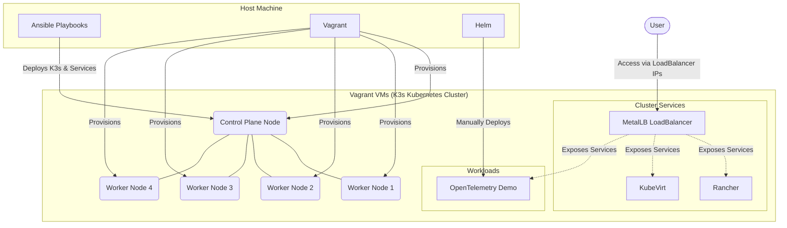

# Project Architecture

This document provides a high-level overview of the microservices and Kubernetes deployment architecture managed by this repository.

## Overview

The infrastructure relies on Vagrant to provision virtual machines and Ansible to configure them. The core system is a multi-node K3s Kubernetes cluster running on these VMs.

## Architecture Diagram

### Components

- **Vagrant**: Provisions the base Virtual Machines using VirtualBox (or preferred provider).
- **Ansible**: Automates the installation of K3s and the deployment of core cluster services (MetalLB, Rancher, KubeVirt).
- **K3s Control Plane & Workers**: Lightweight Kubernetes cluster where the control plane manages the 4 worker nodes.
- **MetalLB**: Provides external LoadBalancer IPs for services within the bare-metal/VM environment.
- **Rancher**: Provides a Web UI for managing the Kubernetes cluster.
- **KubeVirt**: Extends Kubernetes to support managing VMs natively alongside containers.
- **OpenTelemetry Demo**: A sample microservices application deployed manually using Helm to demonstrate observability.
