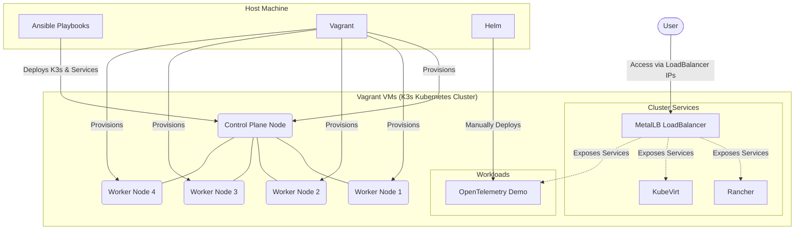

The above diagram visualizes the high-level architecture of the microservices and Kubernetes deployment managed by this repository. It illustrates the infrastructure provisioned by Vagrant, configured via Ansible, and the core services running within the K3s cluster.

---

# Microservices & Kubernetes Deployment

This repository provisions a fully functional, multi-node K3s Kubernetes cluster on local Vagrant VMs using Ansible, and automatically deploys essential infrastructure tools like **MetalLB**, **Rancher**, and **KubeVirt**.

## Features

- **Automated K3s Cluster**: 1 Control Plane, 4 Worker Nodes.
- **MetalLB**: Provides external LoadBalancer IPs for services.
- **Rancher**: Web UI for multi-cluster management.
- **KubeVirt**: Run Virtual Machines natively alongside containers.

## Prerequisites

- [Vagrant](https://www.vagrantup.com/) & VirtualBox (or preferred provider)
- [Ansible](https://docs.ansible.com/)
- `kubectl` & `helm` installed on your host machine

---

## Getting Started

### 1. Bring up the Virtual Machines
This provisions the VMs as defined in the `Vagrantfile`.

```bash
vagrant up
```

### 2. Deploy the Cluster & Addons
The Ansible playbook will install K3s, configure the cluster, copy the kubeconfig to your host, and automatically install the addons (MetalLB, Rancher, and KubeVirt).

```bash
ansible-playbook -i inventory/inventory.yaml playbooks/deploy-k3s.yaml
```

*Note: The playbook is idempotent. You can safely re-run it if something fails.*

---

## Accessing the Applications

Once the playbook completes, wait a few minutes for all pods to become ready (`kubectl get pods -A -w`).

### Rancher
Rancher is exposed via a MetalLB LoadBalancer IP (usually `192.168.56.x`). Check the exact IP:
```bash
kubectl get svc rancher -n cattle-system
```
Access the IP in your browser via `https://<RANCHER_IP>`. (Default bootstrap password: `admin`).

### KubeVirt Manager
Manage your KubeVirt VMs from a web interface. Check the IP:
```bash
kubectl get svc kubevirt-manager -n kubevirt-manager
```
Access via `http://<KUBEVIRT_MANAGER_IP>`.

---

## Manual Deployment: OpenTelemetry Demo

To deploy the OpenTelemetry Demo manually to your cluster, run the following Helm commands. 

> **Important**: To fix the known issue of the Prometheus pod crashing in Vagrant/k3s setups (due to local-path provisioner permissions with the nobody user), we disable the persistent volumes for Prometheus and Alertmanager in the helm install command below.

```bash
helm repo add open-telemetry https://open-telemetry.github.io/opentelemetry-helm-charts
helm repo update

helm install my-otel-demo open-telemetry/opentelemetry-demo \
  --namespace default \
  --set grafana.resources.limits.memory=512Mi \
  --set grafana.resources.requests.memory=256Mi \
  --set grafana.shadowBundledPlugins=true \
  --set prometheus.server.persistentVolume.enabled=false \
  --set prometheus.alertmanager.persistentVolume.enabled=false
```

Once running, you can expose the frontend via LoadBalancer:
```bash
kubectl patch svc frontend-proxy -p '{"spec":{"type":"LoadBalancer"}}'
kubectl get svc frontend-proxy -n default
```
Then access it via `http://<EXTERNAL_IP>:8080`.

---

## Cleanup

To completely remove K3s and all installed components from the VMs without destroying the VMs themselves:

```bash
ansible-playbook -i inventory/inventory.yaml playbooks/uninstall-k3s.yaml
```

If you want to destroy the VMs entirely:
```bash
vagrant destroy -f
```

## Architecture & Details

For deeper insights into the configuration, check out the [Documentation folder](./Documentation), which contains the manual steps that were converted into this automated deployment, and explanations of Kubernetes concepts.